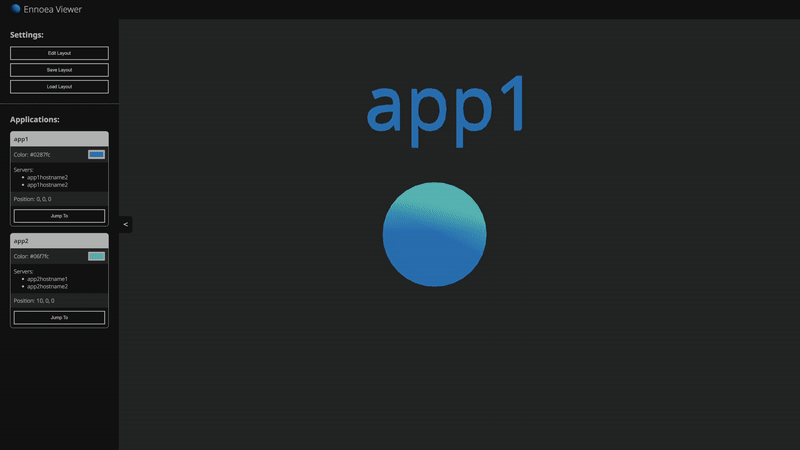
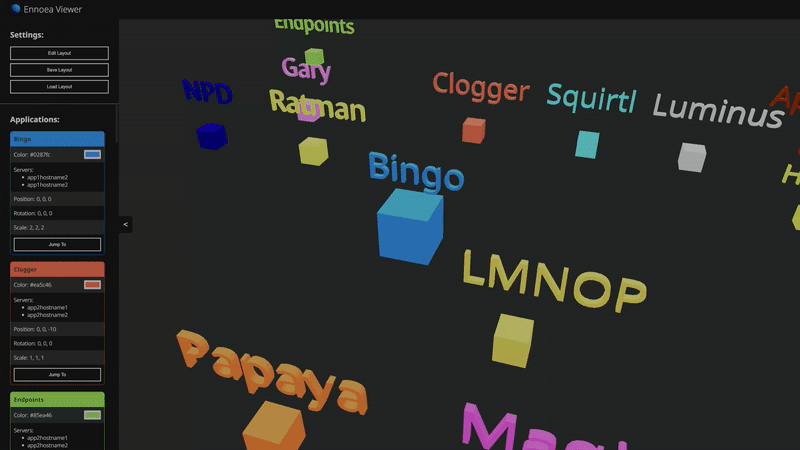

# ennoea-architecture-viewer

</img>


A web based tool for viewing application and infrastucture architectures in a 3d space.

**Warning: this application is still pre-release alpha. It is not in a state that it should be used by people.**

## Contents

- [ennoea-architecture-viewer](#ennoea-architecture-viewer)
  - [Contents](#contents)
  - [Building](#building)
    - [Prerequisites](#prerequisites)
    - [Go](#go)
    - [NPM](#npm)
  - [Compiling](#compiling)
  - [Running](#running)

## Building

### Prerequisites

This tool has 2 main prerequisite dependencies that will need to be installed before building the application. These are `go` for the backend server and `npm` for the frontend.

### Go

Install the appropriate `go` version for your operating system from the golang website here - <https://go.dev/doc/install>

### NPM

Install the appropriate `npm` version for your operating system from the npm website here - <https://nodejs.org/en/download/>

## Compiling

There is a `Makefile` in the repo that contains build commands for compiling the Go server and to run the webpack build commands. Run the following to build everything at once.

```bash
make
```

## Running

```bash
make start
```

After the application has been started, go to <http://localhost:8080> in your browser.

## Screenshots

Easily load new application data by editing the json with mirrorcode.


Select and view the details of a component by clicking on it.

